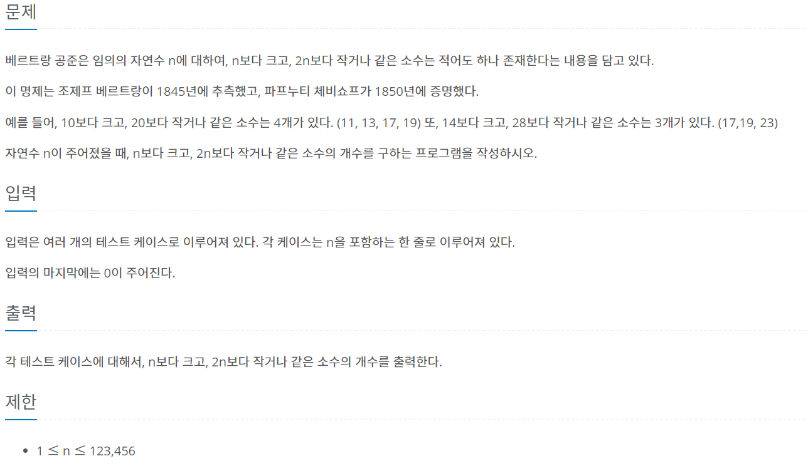

```java
import java.util.Scanner;

public class Test {
		
	public static void main(String[] args) {

		Scanner sc = new Scanner(System.in); 
		
		boolean[] check = new boolean[246913];
		int[] arr = new int[246913]; 
		check[0] = check[1] = true; 
		
		for(int i=2; i<=Math.sqrt(246913);i++) {
			if(check[i]==true) continue; 
			for(int j=i*i; j<=246913; j=j+i) check[j]=true; 
		} 
		
		int count =0;
		for(int i=2;i<246913;i++) {
			if(!check[i]) count++;
			arr[i] = count;
		}
		
		int n = 1;
		while(true) {
			n = sc.nextInt();
			if (n==0) break;
			System.out.println(arr[2*n] - arr[n]);	
		}
	}
}
```